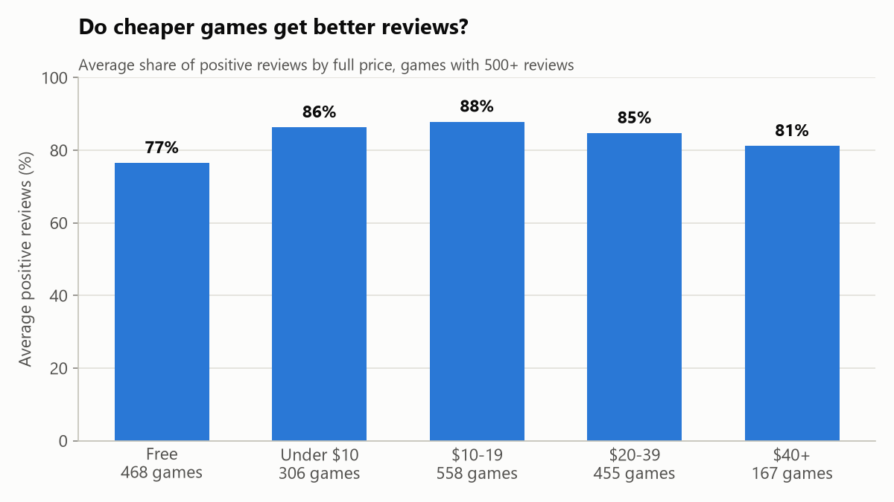
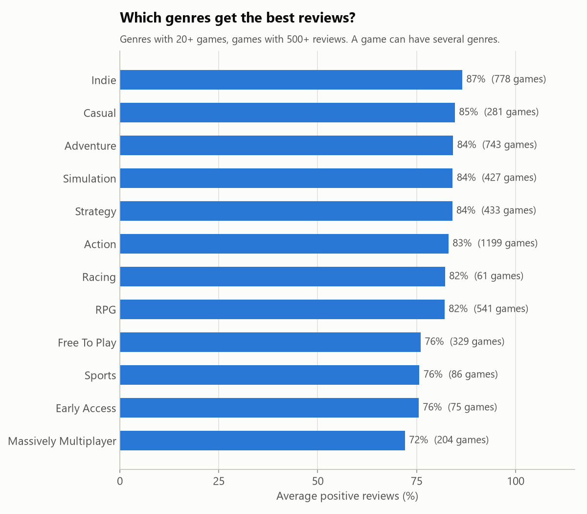
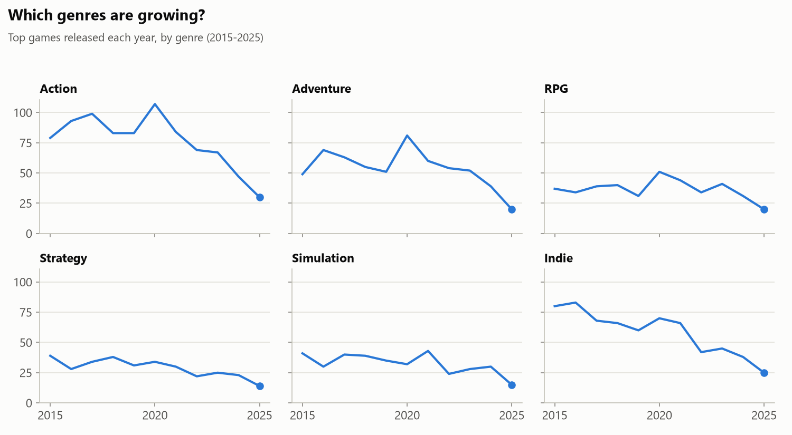
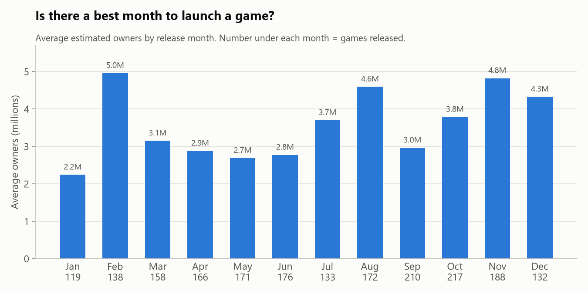

# What Makes a Steam Game Successful?

I looked at the top 2,000 games on Steam to answer four business questions:

1. Do cheaper games get better reviews?
2. Which genres are most common, and which get the best reviews?
3. Which genres are growing?
4. Is there a best month to launch a game?

## Key Findings

*(Write these once the analysis is done. One or two sentences each, with a number.)*

- **Price vs. reviews:**
- **Genres:**
- **Growth:**
- **Launch month:**

## How I Did It

1. **Collected the data** with Python from two free APIs. [SteamSpy](https://steamspy.com/api.php) gave owners, reviews and price. The [Steam store API](https://store.steampowered.com/api/appdetails) gave release dates and genres.
2. **Cleaned it** with pandas. I turned owner ranges into numbers, fixed mixed date formats, and removed DLC and software.
3. **Loaded it into SQLite** with two tables, `games` and `game_genres`.
4. **Answered each question with SQL.** See [`sql/analysis.sql`](sql/analysis.sql).
5. **Made charts** with matplotlib. See [`src/make_charts.py`](src/make_charts.py).

## Charts






## Limits of This Data

- The data only covers the 2,000 most-owned games, so it shows what works for hits, not for the average game.
- Newer games haven't had as much time to build up owners, so fewer of them make the top 2,000. That's why every genre seems to drop after 2020.
- SteamSpy gives owner counts as ranges (for example, 1-2 million), so owner numbers are estimates.
- Prices and player counts are from one day (September 2026).

## Run It Yourself

```
pip install -r requirements.txt
python src/collect_data.py        # downloads data, about 1 hour
python src/build_database.py      # builds data/steam.db
python src/run_sql.py sql/analysis.sql
python src/make_charts.py         # saves charts to charts/
```

## Tools

Python (pandas, requests), SQL (SQLite), matplotlib
